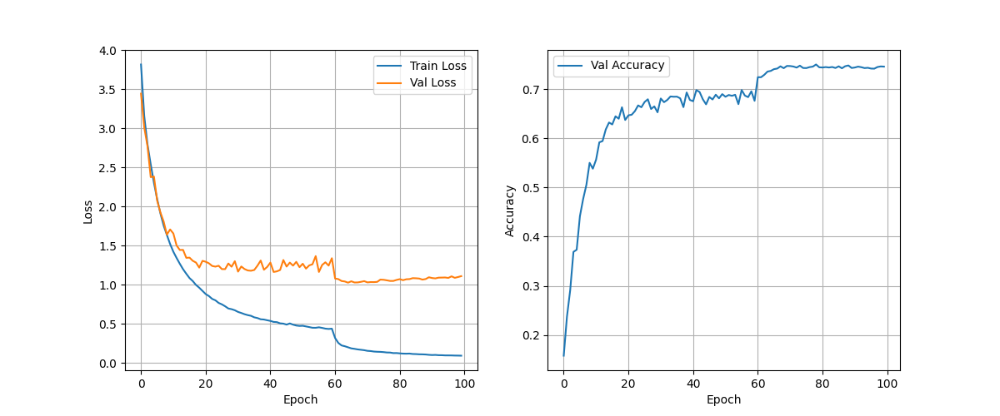

# Fruit Classification Project 🍎🍌🍒

## Description
This project focuses on classifying images of fruits using a ResNet50 model. The goal is to predict the fruit type from a given image. The model is trained on a dataset containing 100 different fruits and is trained for 100 iterations on an NVIDIA RTX 4080 GPU with 8GB of memory. One challenge was handling the test data format, which initially had placeholder values (-1) instead of true labels. To overcome this, all predictions were saved in a CSV file, and a majority voting technique was used to predict the final label for each fruit category.

## Files Overview 📂

### custom_dataset.py
- This file contains code to load and preprocess custom datasets.
- Includes data augmentation techniques and transformation logic specific to the fruit images dataset.

### model.py
- Defines the model architecture, which is based on ResNet50.
- Contains functions to initialize the model and possibly load pre-trained weights.

### train.py
- Script for training the model using the fruit dataset.
- Handles data loading, model training loop, loss calculation, and optimization.
- Includes code to save the trained model weights.

### configuration.py
- Contains paths to dataset directories and other file paths needed during training and evaluation.

### config.yaml
- Contains configuration settings for the training process.
- Includes hyperparameters like learning rate, batch size, number of epochs, etc.

### predict.py
- Script used for making predictions on new images using the trained model.
- Handles loading the model weights and preprocessing new images for prediction.
- Implements the "majority voting" technique to refine predictions based on grouped test data.


## Dataset and Research Paper Links

- Dataset: [Fruit Classification Dataset](https://www.kaggle.com/datasets/icebearogo/fruit-classification-dataset) 📂🍎
- Research Paper: [Deep Residual Learning for Image Recognition](https://arxiv.org/abs/1512.03385) 📄🔍


## Training Process

## Training Process 📈
The model was trained using the following setup:
- Fine tune a ResNet50 model by freezing all layers except last Sequential and Classification modules
- GPU: Nvidia GeForce RTX 4060 with 8GB RAM (~15min/epoch)
- Adam optimizer with weigth decay at ```1e-5``` with a scheduler
- see ```config.yaml``` file for other informations




## Results and Techniques 📊

### F1 score >= 0.85 :1st_place_medal:

| Class         | Precision | Recall | F1-score | Support |
|---------------|-----------|--------|----------|---------|
| horned_melon  | 0.98      | 0.96   | 0.97     | 50      |
| taxus_baccata | 0.98      | 0.98   | 0.98     | 50      |
| bitter_gourd  | 0.98      | 0.92   | 0.95     | 50      |
| camu_camu     | 0.92      | 0.94   | 0.93     | 50      |
| sea_buckthorn | 0.91      | 0.96   | 0.93     | 50      |
| pineapple     | 0.94      | 0.90   | 0.92     | 50      |
| raspberry     | 0.90      | 0.94   | 0.92     | 50      |
| white_currant | 0.92      | 0.90   | 0.91     | 50      |
| banana        | 0.92      | 0.88   | 0.90     | 50      |
| chenet        | 0.88      | 0.88   | 0.88     | 50      |
| salak         | 0.91      | 0.84   | 0.88     | 50      |
| mabolo        | 0.91      | 0.84   | 0.88     | 50      |
| morinda       | 0.91      | 0.86   | 0.89     | 50      |

### 0.75 =< F1 score < 0.85 :2nd_place_medal:

| Class             | Precision | Recall | F1-score | Support |
|-------------------|-----------|--------|----------|---------|
| gooseberry        | 0.69      | 0.58   | 0.63     | 50      |
| cashew            | 0.84      | 0.86   | 0.85     | 50      |
| pea               | 0.85      | 0.88   | 0.86     | 50      |
| pomegranate       | 0.89      | 0.78   | 0.83     | 50      |
| coconut           | 0.78      | 0.76   | 0.77     | 50      |
| durian            | 0.85      | 0.88   | 0.86     | 50      |
| ackee             | 0.86      | 0.86   | 0.86     | 50      |
| fig               | 0.76      | 0.84   | 0.80     | 50      |
| langsat           | 0.74      | 0.86   | 0.80     | 50      |
| redcurrant        | 0.84      | 0.92   | 0.88     | 50      |
| jalapeno          | 0.80      | 0.88   | 0.84     | 50      |
| brazil_nut        | 0.82      | 0.90   | 0.86     | 50      |
| damson            | 0.84      | 0.82   | 0.83     | 50      |
| jaboticaba        | 0.76      | 0.82   | 0.79     | 50      |
| yali_pear         | 0.85      | 0.78   | 0.81     | 50      |
| rose_leaf_bramble | 0.82      | 0.80   | 0.81     | 50      |
| cluster_fig       | 0.72      | 0.68   | 0.70     | 50      |
| corn_kernel       | 0.87      | 0.82   | 0.85     | 50      |
| kumquat           | 0.90      | 0.74   | 0.81     | 50      |
| apple             | 0.76      | 0.62   | 0.68     | 50      |
| guava             | 0.74      | 0.58   | 0.65     | 50      |
| emblic            | 0.75      | 0.84   | 0.79     | 50      |
| papaya            | 0.74      | 0.84   | 0.79     | 50      |
| goumi             | 0.78      | 0.86   | 0.82     | 50      |
| lablab            | 0.85      | 0.88   | 0.86     | 50      |
| cempedak          | 0.82      | 0.64   | 0.72     | 50      |
| jackfruit         | 0.72      | 0.92   | 0.81     | 50      |
| kaffir_lime       | 0.85      | 0.90   | 0.87     | 50      |
| jambul            | 0.73      | 0.80   | 0.76     | 50      |

### 0.60 <= F1 score < 0.75 :3rd_place_medal:

| Class            | Precision | Recall | F1-score | Support |
|------------------|-----------|--------|----------|---------|
| sugar_apple      | 0.53      | 0.56   | 0.54     | 50      |
| yellow_plum      | 0.70      | 0.62   | 0.66     | 50      |
| dewberry         | 0.55      | 0.48   | 0.51     | 50      |
| plumcot          | 0.62      | 0.60   | 0.61     | 50      |
| ambarella        | 0.55      | 0.62   | 0.58     | 50      |
| grenadilla       | 0.56      | 0.56   | 0.56     | 50      |
| barbadine        | 0.60      | 0.62   | 0.61     | 50      |
| pawpaw           | 0.60      | 0.62   | 0.61     | 50      |
| grapefruit       | 0.62      | 0.56   | 0.59     | 50      |
| jamaica_cherry   | 0.59      | 0.54   | 0.56     | 50      |
| cherimoya        | 0.57      | 0.60   | 0.58     | 50      |
| otaheite_apple   | 0.51      | 0.54   | 0.52     | 50      |
| apple            | 0.76      | 0.62   | 0.68     | 50      |
| olive            | 0.72      | 0.58   | 0.64     | 50      |
| barberry         | 0.74      | 0.68   | 0.71     | 50      |
| rose_hip         | 0.72      | 0.62   | 0.67     | 50      |
| sapodilla        | 0.57      | 0.64   | 0.60     | 50      |
| hawthorn         | 0.62      | 0.68   | 0.65     | 50      |
| mango            | 0.52      | 0.44   | 0.48     | 50      |
| cranberry        | 0.65      | 0.62   | 0.63     | 50      |
| strawberry_guava | 0.68      | 0.72   | 0.70     | 50      |
| avocado          | 0.71      | 0.78   | 0.74     | 50      |
| passion_fruit    | 0.69      | 0.62   | 0.65     | 50      |
| betel_nut        | 0.68      | 0.72   | 0.70     | 50      |
| quince           | 0.57      | 0.72   | 0.64     | 50      |
| acai             | 0.59      | 0.74   | 0.65     | 50      |
| ugli_fruit       | 0.85      | 0.78   | 0.81     | 50      |
| hard_kiwi        | 0.73      | 0.72   | 0.73     | 50      |


### F1 score < 0.6 :medal_sports:

| Class             | Precision | Recall | F1-score | Support |
|-------------------|-----------|--------|----------|---------|
| hog_plum          | 0.53      | 0.42   | 0.47     | 50      |
| mock_strawberry   | 0.43      | 0.44   | 0.44     | 50      |
| indian_strawberry | 0.49      | 0.54   | 0.51     | 50      |
| chico             | 0.49      | 0.54   | 0.51     | 50      |
| custard_apple     | 0.47      | 0.42   | 0.44     | 50      |
| mountain_soursop  | 0.56      | 0.48   | 0.52     | 50      |
| malay_apple       | 0.55      | 0.56   | 0.55     | 50      |


### Global Metric :checkered_flag:

| Metric          | Value |
|-----------------|-------|
| Accuracy        | 0.74  |
| Macro Avg F1    | 0.74  |
| Weighted Avg F1 | 0.74  |
| Total Samples   | 5000  |


Due to the unique format of the test data, a special technique was used to evaluate model performance:
- All predictions were saved into a CSV file.
- Predictions were grouped by unique labels present in the test file paths (e.g., the XX in test/XX/YYYY.jpg).
- For each group, the most frequent (majority vote) predicted label was selected as the final prediction for that group.
- The majority vote labels were then compared with the original predictions to evaluate performance.

## Future Work

- [x] Automate training with a YAML file. ✅📄
- [ ] Test multiple backbones to improve model performance. 🏋️‍♂️🔁
- [x] Add images and graphs to illustrate results. 📊📈
- [x] Incorporate an F1 score table to evaluate model performance. 📋🏆

<small>this file was enhanced through my Mistral AI Agent</small>